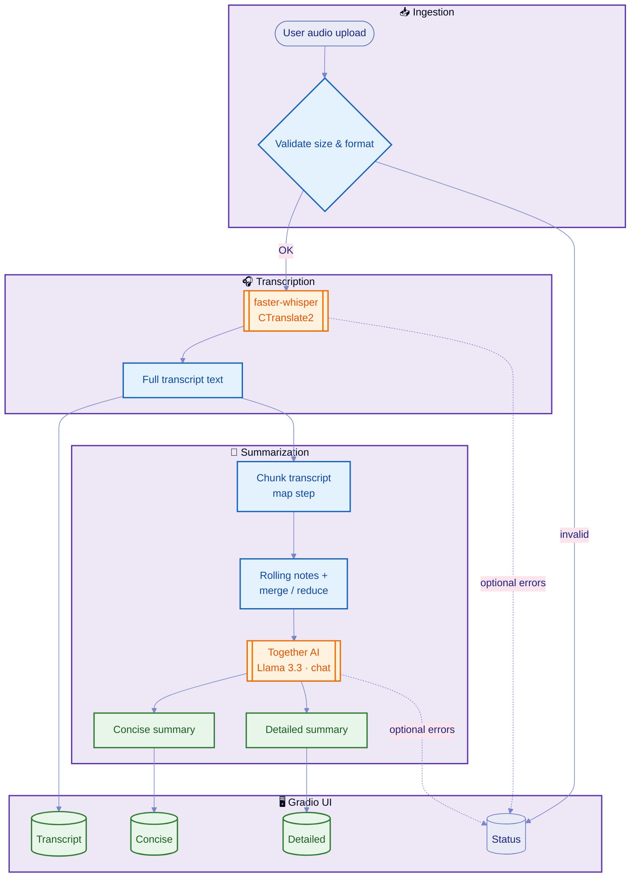

> **Hugging Face Spaces:** This file holds the YAML front matter the Hub uses for your Space card and SDK settings. The Hub reads **`README.md`** at the repository root. When you sync this project to Hugging Face, set the Space repo’s **`README.md`** to the contents of this file (or copy the YAML + body here into `README.md` on the branch you push to the Hub). The GitHub-friendly readme without YAML is [`README.md`](README.md).

<div align="center">

# 🎙️ Audio Pen

**Turn recordings into searchable text and polished summaries — in one flow.**

[](https://www.python.org/)
[](https://www.gradio.app/)
[](https://huggingface.co/docs/hub/spaces-overview)
[](https://www.apache.org/licenses/LICENSE-2.0)
[](https://www.together.ai/)

*CPU-friendly transcription with [faster-whisper](https://github.com/SYSTRAN/faster-whisper) · Intelligent summarization via [Together AI](https://www.together.ai/)*

[Features](#features) · [Architecture](#architecture) · [Quick start](#quick-start) · [Configuration](#configuration) · [Project layout](#project-layout)

</div>

---

## ✨ Features

| | |
|:---:|:---|
| 🎵 | **Multi-format audio** — Common formats via `ffmpeg` (MP3, WAV, WebM, M4A, OGG, FLAC, Opus, …) |
| 📝 | **Full transcript** — Powered by Whisper (`distil-large-v3` by default) through CTranslate2 |
| 🤖 | **Dual summaries** — **Concise** and **detailed** outputs using Together chat completions |
| ⚡ | **Spaces-ready** — Tuned defaults for Hugging Face Spaces (CPU `int8`, sensible beam sizes) |
| 🔒 | **Secrets-safe** — API keys via environment only; never committed |

---

## 🏗️ Architecture

End-to-end pipeline from upload to transcript and summaries, including chunked map–reduce style summarization for long transcripts.



<details>
<summary><strong>Diagram legend</strong></summary>

- **Ingestion** — Upload checks from `audio_utils.py` (size cap, extensions).
- **Transcription** — `transcription.py` loads Whisper and decodes to plain text.
- **Summarization** — `summarization.py` chunks long text, calls Together, then produces both summary styles.
- **Gradio UI** — `app.py` wires inputs, progress, and read-only result panels.

</details>

---

## 🚀 Quick start

### On this Space

1. Open **Settings → Secrets and variables** and add:

   | Name | Value |
   |:-----|:------|
   | `TOGETHER_API_KEY` | Your [Together AI](https://www.together.ai/) API key |

2. Use the app above. Transcription runs without the key; summaries require it.

### From GitHub

Duplicate or connect a repo with this app (Gradio SDK), use the same secrets, and deploy.

### Local run

```bash
git clone https://github.com/YOUR_USERNAME/hf-audio-pen.git
cd hf-audio-pen
python -m venv .venv
# Windows: .venv\Scripts\activate
# macOS/Linux: source .venv/bin/activate
pip install -r requirements.txt
```

Ensure **ffmpeg** is installed (used for decoding). Then:

```bash
set TOGETHER_API_KEY=your_key_here          # Windows CMD
$env:TOGETHER_API_KEY="your_key_here"       # Windows PowerShell
# export TOGETHER_API_KEY=your_key_here     # bash/zsh
python app.py
```

Open the URL Gradio prints (usually `http://127.0.0.1:7860`).

---

## ⚙️ Configuration

### Required for summaries

| Variable | Description |
|:---------|:------------|
| `TOGETHER_API_KEY` | Together API key (required for summarization) |

### Optional

| Variable | Purpose |
|:---------|:--------|
| `TOGETHER_MODEL` | Override LLM (default: `meta-llama/Llama-3.3-70B-Instruct-Turbo`) |
| `WHISPER_MODEL_SIZE` | Whisper checkpoint (default: `distil-large-v3`) |
| `WHISPER_DEVICE` / `WHISPER_COMPUTE_TYPE` | e.g. `cpu` + `int8` on Spaces |
| `WHISPER_BEAM_SIZE` | Decoder beam (default **1** on CPU, **5** on GPU) |
| `WHISPER_VAD_FILTER` | `true` / `false` — voice activity filter |
| `WHISPER_CONDITION_ON_PREVIOUS_TEXT` | Context across segments (`false` can be slightly faster) |
| `SUMMARY_CHUNK_CHARS` | Transcript chunk size for map-reduce |
| `SUMMARY_ROLLING_MAX_CHARS` | Cap for rolling notes during map step (default `24000`) |
| `TOGETHER_CONNECT_TIMEOUT_S` | API connect timeout (default `15`) |
| `LOG_LEVEL` | e.g. `INFO`, `DEBUG` |
| `MAX_AUDIO_MB` | Max upload size (default `100`) |

> **Note:** Long files on **free CPU** Spaces can be slow. Consider a CPU upgrade or GPU in Space settings for heavier workloads.

---

## 📁 Project layout

| Path | Role |
|:-----|:-----|
| `app.py` | Gradio UI — `demo` is the `Blocks` instance Spaces expects |
| `transcription.py` | `faster-whisper` load + decode |
| `audio_utils.py` | Upload validation (size, extension) |
| `summarization.py` | Together chat completions — chunk → merge → concise + detailed |
| `helpers.py` | Shared progress + messaging |
| `logging_config.py` | `LOG_LEVEL` and log format |
| `config.py` | Environment-driven settings |
| `apt.txt` | Installs **ffmpeg** on Spaces for common audio formats |
| `requirements.txt` | Python dependencies |

---

## 📜 License

This project is licensed under the **Apache License 2.0** — see the [Apache 2.0 license text](https://www.apache.org/licenses/LICENSE-2.0) for the full legal terms.

---

<div align="center">

**Built with Gradio · faster-whisper · Together AI**

⭐ *If you use this Space or repo, consider starring it on GitHub or Hugging Face.*

</div>
